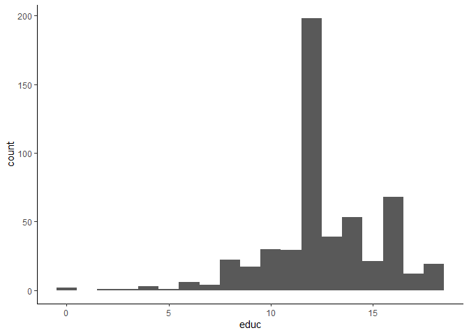
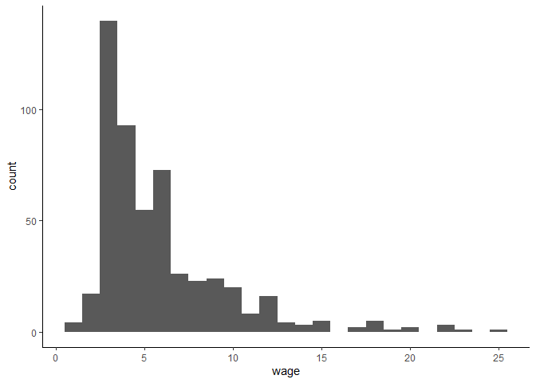

Econometrics Lab
================
Daniel Carpenter
Spring 2019

``` r
#install.packages("tidyverse", repos='http://cran.us.r-project.org')
#install.packages("skimr", repos='http://cran.us.r-project.org')
#install.packages("wooldridge", repos='http://cran.us.r-project.org')

#Loading packages
library(tidyverse)
library(skimr)
library(wooldridge)

#read in data
df <- as_tibble(wage1)

#Stats for Education
skim(df$educ)
```

|                                                  |         |
|:-------------------------------------------------|:--------|
| Name                                             | df$educ |
| Number of rows                                   | 526     |
| Number of columns                                | 1       |
| \_\_\_\_\_\_\_\_\_\_\_\_\_\_\_\_\_\_\_\_\_\_\_   |         |
| Column type frequency:                           |         |
| numeric                                          | 1       |
| \_\_\_\_\_\_\_\_\_\_\_\_\_\_\_\_\_\_\_\_\_\_\_\_ |         |
| Group variables                                  | None    |

Data summary

**Variable type: numeric**

| skim_variable | n_missing | complete_rate |  mean |   sd |  p0 | p25 | p50 | p75 | p100 | hist  |
|:--------------|----------:|--------------:|------:|-----:|----:|----:|----:|----:|-----:|:------|
| data          |         0 |             1 | 12.56 | 2.77 |   0 |  12 |  12 |  14 |   18 | ▁▁▂▇▃ |

``` r
#Mean = 12.56

#Stats for Women
skim(df$female)
```

|                                                  |           |
|:-------------------------------------------------|:----------|
| Name                                             | df$female |
| Number of rows                                   | 526       |
| Number of columns                                | 1         |
| \_\_\_\_\_\_\_\_\_\_\_\_\_\_\_\_\_\_\_\_\_\_\_   |           |
| Column type frequency:                           |           |
| numeric                                          | 1         |
| \_\_\_\_\_\_\_\_\_\_\_\_\_\_\_\_\_\_\_\_\_\_\_\_ |           |
| Group variables                                  | None      |

Data summary

**Variable type: numeric**

| skim_variable | n_missing | complete_rate | mean |  sd |  p0 | p25 | p50 | p75 | p100 | hist  |
|:--------------|----------:|--------------:|-----:|----:|----:|----:|----:|----:|-----:|:------|
| data          |         0 |             1 | 0.48 | 0.5 |   0 |   0 |   0 |   1 |    1 | ▇▁▁▁▇ |

``` r
#Women compose 48% of entire sample

#Visualization
ggplot(df, aes(educ)) + geom_histogram(binwidth=1)+theme_classic()
```

<!-- -->

``` r
#Most common education is about 12

ggplot(df, aes(wage)) + geom_histogram(binwidth=1)+theme_classic()
```

<!-- -->

``` r
#Most common wage = approx. 3

#Wage Mutation
df <- df %>% mutate(realwage=wage*4.53)
summary(df$realwage)
```

    ##    Min. 1st Qu.  Median    Mean 3rd Qu.    Max. 
    ##   2.401  15.085  21.064  26.709  31.166 113.159

``` r
#Filter to see only women
summary(df$female)
```

    ##    Min. 1st Qu.  Median    Mean 3rd Qu.    Max. 
    ##  0.0000  0.0000  0.0000  0.4791  1.0000  1.0000

``` r
df <- df %>% filter(female==1)
summary(df$female)
```

    ##    Min. 1st Qu.  Median    Mean 3rd Qu.    Max. 
    ##       1       1       1       1       1       1

``` r
#Drop N/A's
summary(df$wage)
```

    ##    Min. 1st Qu.  Median    Mean 3rd Qu.    Max. 
    ##   0.530   3.000   3.750   4.588   5.510  21.630

``` r
df <- df %>% filter(!is.na(wage))
summary(df$wage)
```

    ##    Min. 1st Qu.  Median    Mean 3rd Qu.    Max. 
    ##   0.530   3.000   3.750   4.588   5.510  21.630
