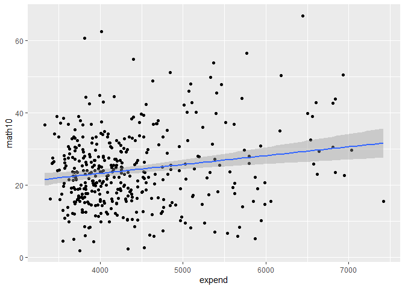

Econometrics Lab
================
Daniel Carpenter
Spring 2019

``` r
library(tidyverse)
library(broom)
library(wooldridge)
library(skimr)

df <-as_tibble(meap93)

#show summary stats
skim(df)
```

|                                                  |      |
|:-------------------------------------------------|:-----|
| Name                                             | df   |
| Number of rows                                   | 408  |
| Number of columns                                | 17   |
| \_\_\_\_\_\_\_\_\_\_\_\_\_\_\_\_\_\_\_\_\_\_\_   |      |
| Column type frequency:                           |      |
| numeric                                          | 17   |
| \_\_\_\_\_\_\_\_\_\_\_\_\_\_\_\_\_\_\_\_\_\_\_\_ |      |
| Group variables                                  | None |

Data summary

**Variable type: numeric**

| skim_variable | n_missing | complete_rate |     mean |      sd |       p0 |      p25 |      p50 |      p75 |     p100 | hist  |
|:--------------|----------:|--------------:|---------:|--------:|---------:|---------:|---------:|---------:|---------:|:------|
| lnchprg       |         0 |             1 |    25.20 |   13.61 |     1.40 |    14.62 |    23.85 |    33.82 |    79.50 | ▆▇▅▁▁ |
| enroll        |         0 |             1 |  2663.81 | 2696.82 |   212.00 |  1037.50 |  1840.50 |  3084.75 | 16793.00 | ▇▁▁▁▁ |
| staff         |         0 |             1 |   100.64 |   13.30 |    65.90 |    91.45 |    99.00 |   108.02 |   166.60 | ▂▇▃▁▁ |
| expend        |         0 |             1 |  4376.58 |  775.79 |  3332.00 |  3821.25 |  4145.00 |  4658.75 |  7419.00 | ▇▅▂▁▁ |
| salary        |         0 |             1 | 31774.51 | 5038.30 | 19764.00 | 28185.50 | 31266.00 | 34499.75 | 52812.00 | ▂▇▅▁▁ |
| benefits      |         0 |             1 |  6463.43 | 1456.34 |     0.00 |  5536.50 |  6304.50 |  7228.00 | 11618.00 | ▁▁▇▃▁ |
| droprate      |         0 |             1 |     5.07 |    5.49 |     0.00 |     1.90 |     3.70 |     6.50 |    61.90 | ▇▁▁▁▁ |
| gradrate      |         0 |             1 |    83.65 |   13.37 |    23.50 |    77.00 |    86.30 |    93.22 |   127.10 | ▁▁▆▇▁ |
| math10        |         0 |             1 |    24.11 |   10.49 |     1.90 |    16.63 |    23.40 |    30.05 |    66.70 | ▂▇▃▁▁ |
| sci11         |         0 |             1 |    49.18 |   12.52 |     7.20 |    41.30 |    49.10 |    57.15 |    85.70 | ▁▂▇▅▁ |
| totcomp       |         0 |             1 | 38237.94 | 5985.09 | 24498.00 | 34032.00 | 37443.50 | 41637.00 | 63518.00 | ▂▇▅▁▁ |
| ltotcomp      |         0 |             1 |    10.54 |    0.15 |    10.11 |    10.44 |    10.53 |    10.64 |    11.06 | ▁▆▇▃▁ |
| lexpend       |         0 |             1 |     8.37 |    0.16 |     8.11 |     8.25 |     8.33 |     8.45 |     8.91 | ▆▇▃▂▁ |
| lenroll       |         0 |             1 |     7.51 |    0.87 |     5.36 |     6.94 |     7.52 |     8.03 |     9.73 | ▂▅▇▃▂ |
| lstaff        |         0 |             1 |     4.60 |    0.13 |     4.19 |     4.52 |     4.60 |     4.68 |     5.12 | ▁▆▇▂▁ |
| bensal        |         0 |             1 |     0.20 |    0.04 |     0.00 |     0.19 |     0.20 |     0.22 |     0.45 | ▁▁▇▁▁ |
| lsalary       |         0 |             1 |    10.35 |    0.15 |     9.89 |    10.25 |    10.35 |    10.45 |    10.87 | ▁▅▇▃▁ |

``` r
#Estimate a regression
est <- lm(math10 ~ expend, data=df)
tidy(est)
```

    ## # A tibble: 2 x 5
    ##   term        estimate std.error statistic    p.value
    ##   <chr>          <dbl>     <dbl>     <dbl>      <dbl>
    ## 1 (Intercept) 13.4      2.93          4.55 0.00000700
    ## 2 expend       0.00246  0.000660      3.72 0.000227

``` r
glance(est)
```

    ## # A tibble: 1 x 12
    ##   r.squared adj.r.squared sigma statistic  p.value    df logLik   AIC   BIC
    ##       <dbl>         <dbl> <dbl>     <dbl>    <dbl> <dbl>  <dbl> <dbl> <dbl>
    ## 1    0.0330        0.0306  10.3      13.8 0.000227     1 -1531. 3067. 3079.
    ## # ... with 3 more variables: deviance <dbl>, df.residual <int>, nobs <int>

``` r
#Get B0 and B1
#change in x means a change in 1 dollar
#Change in y means change in pass rate of 1% point
#When you increase expenditures by $1 per pupil
#Pass rate increases by 0.00246 pp (this came from expend)

#Questions to consider:
#Should we look at a larger number? $1 = small
#Multiply by 1000 to see it. 2.46 pp change
beta1 <- cov(df$math10,df$expend)/var(df$expend)
beta0 <- mean(df$math10)-beta1*mean(df$expend)

#Plot
ggplot(df,aes(expend,math10)) +
  geom_point() +
  geom_smooth(method='lm')
```

<!-- -->

``` r
#Plot Non-linear regression (log)
df <- df %>% mutate(logexpend = log(expend))

#Recreate model
est <- lm(math10 ~ logexpend, data=df)
tidy(est)
```

    ## # A tibble: 2 x 5
    ##   term        estimate std.error statistic  p.value
    ##   <chr>          <dbl>     <dbl>     <dbl>    <dbl>
    ## 1 (Intercept)    -69.3     26.5      -2.61 0.00929 
    ## 2 logexpend       11.2      3.17      3.52 0.000475

``` r
glance(est)
```

    ## # A tibble: 1 x 12
    ##   r.squared adj.r.squared sigma statistic  p.value    df logLik   AIC   BIC
    ##       <dbl>         <dbl> <dbl>     <dbl>    <dbl> <dbl>  <dbl> <dbl> <dbl>
    ## 1    0.0297        0.0273  10.3      12.4 0.000475     1 -1531. 3069. 3081.
    ## # ... with 3 more variables: deviance <dbl>, df.residual <int>, nobs <int>

``` r
ggplot(df,aes(logexpend,math10)) +
  geom_point() +
  geom_smooth(method='lm')
```

<!-- -->

``` r
# Interpretation: B1 Hat = 11.2
# When you increase spending by 10%, pass rates increase by 1.12 pp.

#Compute standard error by hand
n <- dim(df)[1]
sig <- sqrt( sum (est$residuals^2) /(n-2) ) # or, more simply, glance(est)$sigma
SSTx <- (n-1)*var(df$logexpend)
sumx2 <- sum(df$logexpend^2)

#Std error of intercept
sqrt((sig^2*(1/n)*sumx2)/SSTx)
```

    ## [1] 26.53013

``` r
#Std error of slope coefficient
sqrt(sig^2/SSTx)
```

    ## [1] 3.169011
