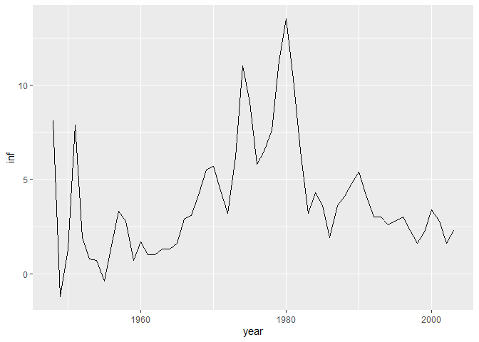

Econometrics Lab
================
Daniel Carpenter
Spring 2019

``` r
#KEYS:
#1. LAG OPERATION: REGRESSION THAT PULLS THE LAG OF PERIOD FOR YOU
#2. TEST FOR SERIAL CORRELATION 
    #a. (HYP TEST: if p-value small/t-stat large, then there is serial correlation)
#3 TEST FOR SERIAL CORRELATION WHEN DO NOT HAVE STRICT EXOGENTATING (meaning add other variables in)


library(tidyverse)
library(wooldridge)
library(broom)
library(car)
library(pdfetch)    #used to pull from web
library(magrittr)
library(tsibble)    #used to get time series data


df.ts <- as_tsibble(intdef, index=year)
  ggplot(df.ts, aes(year,inf)) + geom_line()
```

<!-- -->

``` r
  # ?intdef

#1. LAG OPERATION: REGRESSION THAT PULLS THE LAG OF PERIOD FOR YOU
  est <- lm(i3 ~ inf + lag(inf,1) + lag(inf,2) + def, data=df.ts)
  tidy(est)
```

    ## # A tibble: 5 x 5
    ##   term        estimate std.error statistic  p.value
    ##   <chr>          <dbl>     <dbl>     <dbl>    <dbl>
    ## 1 (Intercept)    1.65      0.452     3.65  0.000643
    ## 2 inf            0.497     0.132     3.77  0.000439
    ## 3 lag(inf, 1)    0.142     0.156     0.908 0.368   
    ## 4 lag(inf, 2)    0.135     0.122     1.10  0.275   
    ## 5 def            0.222     0.159     1.39  0.170

``` r
  #INTERPRETATION:
  #Current inflation is stats. significant, but past years do not play large effect.
  #Past years not significant because: p-value large, t-stats less than 2.

        
#2. TEST FOR SERIAL CORRELATION (HYP TEST: if p-value small/t-stat large, then there is serial correlation)
  
  #a. DROP NA's FROM LAGS -- first two rows undefined because of t-1 and t-2 lags
  residtemp <- c(NA,NA,resid(est)) 
  df.ts %<>% mutate(resids = residtemp)
  
  #b. REGRESSION FOR HYP. TEST
  est.resid <- lm(resids ~ lag(resids), data=df.ts)
  tidy(est.resid)
```

    ## # A tibble: 2 x 5
    ##   term        estimate std.error statistic       p.value
    ##   <chr>          <dbl>     <dbl>     <dbl>         <dbl>
    ## 1 (Intercept) 0.000656     0.168   0.00390 0.997        
    ## 2 lag(resids) 0.712        0.102   7.01    0.00000000521

``` r
  #INTERPRETATION: 
  #p-value low, so REJECT NULL HYP that there is NOT serial corrlation
          
#3 TEST FOR SERIAL CORRELATION WHEN DO NOT HAVE STRICT EXOGENTATING (meaning add other variables in)

  #a. ADD IN OTHER VARIABLES
  est.resid.endog <- lm(resids ~ lag(resids) + inf + lag(inf,1) + lag(inf,2) + def, data = df.ts)
  tidy(est.resid.endog)
```

    ## # A tibble: 6 x 5
    ##   term        estimate std.error statistic       p.value
    ##   <chr>          <dbl>     <dbl>     <dbl>         <dbl>
    ## 1 (Intercept)   0.0295    0.317     0.0931 0.926        
    ## 2 lag(resids)   0.721     0.104     6.95   0.00000000977
    ## 3 inf          -0.0134    0.0933   -0.144  0.886        
    ## 4 lag(inf, 1)  -0.0894    0.123    -0.727  0.471        
    ## 5 lag(inf, 2)   0.144     0.100     1.44   0.156        
    ## 6 def          -0.105     0.113    -0.926  0.359

``` r
  #INTERPRETATION
  #p-value of lag(residuals) still low, so can still reject null(therefore, serial correll exists.)
```
