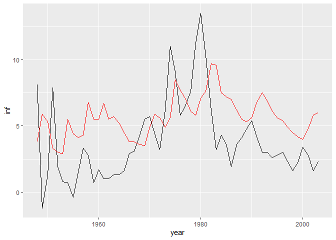

Econometrics Lab
================
Daniel Carpenter
Spring 2019

``` r
#1. TEST FOR SERIAL CORRELATIN = bgtest()

library(tidyverse)
library(wooldridge)
library(broom)
library(car)
library(pdfetch)
library(zoo)
library(lmtest)
library(sandwich)
library(dynlm)

df <- as_tibble(phillips)
df.ts <- zoo(df, order.by=df$year)
ggplot(df.ts, aes(year, inf)) + geom_line() + geom_line(data=df.ts, aes(year, unem), color="red")
```

<!-- -->

``` r
#RELATIONSHIP BETWEEN UNEMP and INFLATION? 
est <- dynlm(inf ~ unem, data=df.ts)
tidy(est)
```

    ## # A tibble: 2 x 5
    ##   term        estimate std.error statistic p.value
    ##   <chr>          <dbl>     <dbl>     <dbl>   <dbl>
    ## 1 (Intercept)    1.05      1.55      0.681  0.499 
    ## 2 unem           0.502     0.266     1.89   0.0639

``` r
#INTERPRETATION:
#Claims positive correlation? Cannot be right based on phillips curve
#unemployment p value good at 10%, bad at 5%. 


#LOOK AT LAG TO SEE IMPACT ON INFLATION, TEST FOR SERIAL CORRELL
resids = resid(est)
df.ts2 <-resids
# lm(resids ~ lag(resids), data=df.ts2) %>% tidy
bgtest(est) #test for serial
```

    ## 
    ##  Breusch-Godfrey test for serial correlation of order up to 1
    ## 
    ## data:  est
    ## LM test = 20.888, df = 1, p-value = 4.87e-06

``` r
#INTERPRETATION
#Yes, there is serial correlation becasue p value super low
    
    
#DO NEWEY WEST TO CORRECT FOR SERIAL CORRELATION
coeftest(est) # re-display baseline results
```

    ## 
    ## t test of coefficients:
    ## 
    ##             Estimate Std. Error t value Pr(>|t|)  
    ## (Intercept)  1.05357    1.54796  0.6806  0.49902  
    ## unem         0.50238    0.26556  1.8918  0.06389 .
    ## ---
    ## Signif. codes:  0 '***' 0.001 '**' 0.01 '*' 0.05 '.' 0.1 ' ' 1

``` r
coeftest(est, vcov=NeweyWest)
```

    ## 
    ## t test of coefficients:
    ## 
    ##             Estimate Std. Error t value Pr(>|t|)
    ## (Intercept)  1.05357    1.56089  0.6750   0.5026
    ## unem         0.50238    0.36794  1.3654   0.1778

``` r
#INTERPRETATION
#Because there was serial correlation, we now adjusted for it,
#we are now able to see that the p-value increased by 3x previous value, so we are good.
    
    
#LOOK AT DIFFERENCE IN INFLATION TO SEE RELATIONSHIP, AKA Do expectations matter?
est.diff <- lm(lag(inf) ~ unem, data = df.ts)
tidy(est.diff)
```

    ## # A tibble: 2 x 5
    ##   term        estimate std.error statistic   p.value
    ##   <chr>          <dbl>     <dbl>     <dbl>     <dbl>
    ## 1 (Intercept)    -2.31     1.38      -1.68 0.0998   
    ## 2 unem            1.10     0.236      4.66 0.0000217

``` r
#INTERPRETATION
#Now unemployment and inflation have negative correll
    
    
#NOW DO BG TEST TO TEST FOR LAG
bgtest(est.diff)
```

    ## 
    ##  Breusch-Godfrey test for serial correlation of order up to 1
    ## 
    ## data:  est.diff
    ## LM test = 17.553, df = 1, p-value = 2.794e-05

``` r
#INTERPRETATION
#No longer serial correlation, can see through p-value results

    
#ARE SE's good?    
coeftest(est, vcov=NeweyWest)
```

    ## 
    ## t test of coefficients:
    ## 
    ##             Estimate Std. Error t value Pr(>|t|)
    ## (Intercept)  1.05357    1.56089  0.6750   0.5026
    ## unem         0.50238    0.36794  1.3654   0.1778

``` r
coeftest(est.diff, vcov=NeweyWest)
```

    ## 
    ## t test of coefficients:
    ## 
    ##             Estimate Std. Error t value Pr(>|t|)  
    ## (Intercept) -2.31446    2.06145 -1.1227  0.26661  
    ## unem         1.09880    0.42387  2.5923  0.01229 *
    ## ---
    ## Signif. codes:  0 '***' 0.001 '**' 0.01 '*' 0.05 '.' 0.1 ' ' 1

``` r
#The SE's decreased
```
